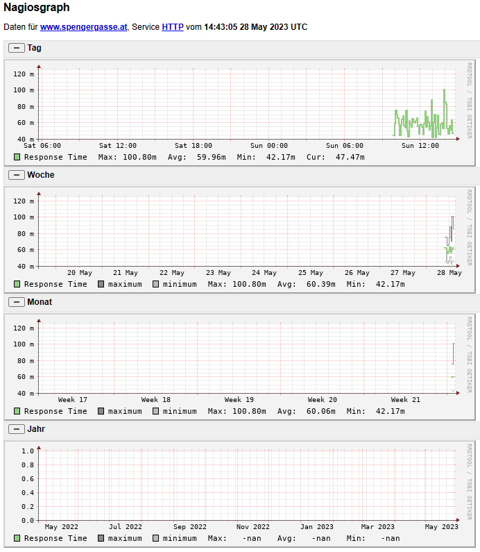

# Installation eines Nagios Überwachungsservers

> **Name:** Max Mustermann  
> **Klasse:** 6AAIF

## Erstellen des Docker Containers

Auf https://github.com/JasonRivers/Docker-Nagios wird ein Dockerfile bereitgestellt, welches Nagios Core sowie die Nagios Plugins in ein Ubuntu 20.04 Image installiert.
Zuerst wird mit `git clone https://github.com/JasonRivers/Docker-Nagios` das Repository geladen.
Danach muss das Dockerfile angepasst werden, um einige Pakete, die die check commands benötigen, zu installieren.
Das check Kommando *check_ssl_validity* benötigt die Perl Pakete *libcrypt-x509-perl* und *libtext-glob-perl*.
Zusätzlich werden nicht benötigte Plugins wie ncpa und das Nagios TV Theme entfernt, damit das Image kleiner wird.

**Dockerfile**
```dockerfile
RUN apt-get update && apt-get install -y    \
    # ...
    libcrypt-x509-perl                  \
    libtext-glob-perl                   \
    net-tools                           \
    # ...
```

Die check Plugins für MSSQL Server Datenbanken werden auch entfernt, da sie Pakete der x86 Architektur verwenden.
Das Docker Image soll auch auf M2 Plattformen erstellt werden, deswegen dürfen keine plattformabhängigen Pakete verwendet werden.

Die Schritte, die im Dockerfile durchgeführt werden, sind folgende:

1. Als Grundimage wird Ubuntu 20.04 verwendet.
2. Mit *apt-get* werden die build tools, apache2, perl, python und php installiert.
3. Der Sourcecode von Nagios Core wird von https://github.com/NagiosEnterprises/nagioscore geladen und mit *make install* kompiliert.
4. Der Sourcecode der Core Plugins, die die check Kommandos bereitstellen, wird von https://github.com/nagios-plugins/nagios-plugins geladen und mit *make install* kompiliert.
5. Der Sourcecode von Nagios Graph wird von https://git.code.sf.net/p/nagiosgraph/git geladen und das Installskript *install.pl* wird ausgeführt.

### Erstellen der Konfigurationsdateien

Im Dockerfile wird mit folgendem Befehl das Verzeichnis *overlay* in den Container kopiert.
Dadurch können wir in */overlay/opt/nagios/etc* eine Konfiguration vorab erstellen, die schon mit dem ersten Starten des Containers zur Verfügung steht.

**Dockerfile**
```dockerfile
ADD overlay /
```

Zuerst ergänzen wir in der Datei *overlay/opt/nagios/etc/nagios.cfg* eine Zeile, die ein eigenes Verzeichnis für die Konfiguration des Spengergassen Netzwerkes inkludiert.

***/overlay/opt/nagios/etc/nagios.cfg***
```
cfg_dir=/opt/nagios/etc/spengergasse
```

Nun können wir in *overlay/opt/nagios/etc/spengergasse* die Konfiguration anlegen, die nachfolgend beschrieben wird.

### Erstellen des Images und Starten des Containers

Das Image kann auf Windows und macOS mit dem *docker build* Befehl erstellt werden.
Bei der Imageerstellung werden die Plugins mit dem gcc Compiler für die entsprechende Plattform kompiliert.
Dadurch ist das erstellte Image auf x86 und auf ARM Plattformen (Apple M2, Raspberry Pi) lauffähig.

```
docker build -t nagios-6aaif .
```

Nachdem das Erstellen fertig ist, kann der Container gestartet werden.
Damit die Konfiguration nachträglich noch verändert werden kann, mounten wir das Konfigurationsverzeichnis in einen Ordner des Hostsystems.

**Windows Eingabeaufforderung**
```
docker run -d --name nagios-6aaif -v C:\Temp\nagios\etc:/opt/nagios/etc/ -p 0.0.0.0:8080:80 nagios-6aaif
```

**macOS**
```
docker run -d --name nagios-6aaif -v $HOME/nagios/etc:/opt/nagios/etc/ -p 0.0.0.0:8080:80 nagios-6aaif
```

### Login

Über das Portforwarding kann die Adresse http://localhost:8080 im Hostsystem aufgerufen werden.
Die Anmeldedaten werden auf folgende Standardwerte gesetzt:

**Username:** nagiosadmin  
**Passwort:** nagios

Sollen andere Daten verwendet werden, können die Umgebungsvariablen *NAGIOSADMIN_USER* und *NAGIOSADMIN_PASS* im *docker run* Befehl gesetzt werden.

## Beschreibung der Konfiguration

Zur besseren Übersicht werden die Konfigurationsdateien aufgeteilt und in den Ordner *spengergasse* gegeben.
Da der ganze Ordner in der Datei *nagios.cfg* inkludiert wurde, werden alle Dateien gelesen.
Die Zahlen im Dateinamen stellen sicher, dass die Reihenfolge eingehalten wird.
Manche Konfigurationseinstellungen verwenden Objekte, die in vorigen Dateien angelegt wurden.

```
📁 overlay/opt/nagios/etc
    ├── nagios.cfg
    └──📂 spengergasse
           ├── 01_spengergasse_hostgroup.cfg
           ├── 02_spengergasse_commands.cfg
           ├── 10_spengergasse_host_templates.cfg
           ├── 20_gateway.cfg
           ├── 21_ldap_spengergasse_at.cfg
           ├── 22_www_spengergasse_at.cfg
           ├── 23_e-formular_spengergasse_at.cfg
           └── check_gateway.sh
```

### Anlegen der Hostgruppen: *01_spengergasse_hostgroup.cfg*

Durch Hostgruppen können in der Weboberfläche die überwachten Hosts gruppiert werden.
Wir definieren eine Hostgroup für die überwachten Server, und eine zweite Hostgroup für aktive Netzwerkkomponenten wie Router, Switches, etc.

```
define hostgroup {
        hostgroup_name  spengergasse-servers    ; The name of the hostgroup
        alias           Server der Spengergasse ; Long name of the group
}

define hostgroup {
        hostgroup_name  spengergasse-core-network
        alias           Core Network der Spengergasse
}
```

### Anlegen der check commands: *02_spengergasse_commands.cfg*

Technisch gesehen führt Nagios periodisch ein Kommando über die Shell aus.
Das Skript gibt einen Rückgabecode an das Betriebssystem zurück, der ausgewertet wird.
In der Dokumentation sind 4 Rückgabecodes definiert:

| Plugin Return Code | Service State | Host State             |
| ------------------ | ------------- | ---------------------- |
| 0                  | OK            | UP                     |
| 1                  | WARNING       | UP or DOWN/UNREACHABLE |
| 2                  | CRITICAL      | DOWN/UNREACHABLE       |
| 3                  | UNKNOWN       | DOWN/UNREACHABLE       |

<small>Quelle: https://assets.nagios.com/downloads/nagioscore/docs/nagioscore/4/en/pluginapi.html</small>

In */opt/nagios/libexec* werden verschiedene Plugins bereits mit der Installation ausgeliefert.

```
check_apt       check_file_age      check_jabber       check_nntps     check_real          check_time
check_breeze    check_flexlm        check_ldap         check_nt        check_rpc           check_udp
check_by_ssh    check_fping         check_ldaps        check_ntp       check_sensors       check_ups
check_clamd     check_ftp           check_load         check_ntp_peer  check_simap         check_uptime
check_cluster   check_hpjd          check_log          check_ntp_time  check_smtp          check_users
check_dbi       check_http          check_mailq        check_nwstat    check_snmp          check_wave
check_dhcp      check_icmp          check_mrtg         check_oracle    check_spop          mibs
check_dig       check_ide_smart     check_mrtgtraf     check_overcr    check_ssh           negate
check_disk      check_ifoperstatus  check_mysql        check_pgsql     check_ssl_validity  remove_perfdata
check_disk_smb  check_ifstatus      check_mysql_query  check_ping      check_ssmtp         urlize
check_dns       check_imap          check_nagios       check_pop       check_swap          utils.pm
check_dummy     check_ircd          check_nntp         check_procs     check_tcp           utils.sh
```

Meist sind sie in C geschrieben.
Der Quellcode befindet sich im Repository https://github.com/nagios-plugins/nagios-plugins.
Diese Skripts können auch direkt in der Bash ausgeführt werden.
So liefert z. B. *check_ldap*, ob ein anonymes Bind mit einem Host über LDAPS, Protokollversion 2, erfolgreich war:

```
/opt/nagios/libexec/check_ldap -H ldap.spengergasse.at -b DC=htl-wien5,DC=schule -S -2
LDAP OK - 0.199 seconds response time|time=0.198680s;;;0.000000
```

#### LDAP Check

```
define command {
        command_name    check_ldap
        command_line    $USER1$/check_ldap -H $HOSTNAME$ -b $ARG1$ -S -2
}
```
Dieser check command ruft das Skript *check_ldap* mit dem Hostnamen als Argument (-H) auf.
Der Parameter *-S* verwendet SSL (LDAPS) auf Port 636, der Parameter *-2* gibt die Protokollversion 2 an.
*$USER1$* ist in der Datei */opt/nagios/etc/resource.cfg* als Variable definiert und zeigt auf das Verzeichnis */opt/nagios/libexec*.
*$HOSTNAME$* wird von Nagios auf den konfigurierten Hostnamen des Hosts gesetzt. 
Der BaseDN (Parameter *-b*) wird von *$ARG1$* gelesen kann bei der Servicedefinition angegeben werden (siehe Services).

> **Wichtig:** *check_ldap* muss den Hostnamen prüfen, nicht die IP Adresse.
> Die Gültigkeit des Zertifikates kann nur bei übergebenem Hostnamen geprüft werden.

#### HTTP Checks

Für HTTP Server brauchen wir 2 check Kommandos.
Das erste Kommando führt einen HTTP/1.1 Request aus und prüft den HTTP Statuscode auf Erfolg.
Das zweite Kommando prüft das ausgelieferte SSL Zertifikat und warnt, wenn dieses in der nächsten Zeit abläuft.

```
# Check HTTP Response by hostname (not IP)
define command{
        command_name    check_http_by_hostname
        command_line    $USER1$/check_http -H $HOSTNAME$ $ARG1$
}

# Check HTTPS certificates
define command {
        command_name    check_ssl_validity
        command_line    $USER1$/check_ssl_validity -H $HOSTNAME$  -w $ARG1$ -c $ARG2$
}
```

#### Gateway check

Schwieriger ist der Check des Gateways.
Die IP Adresse des Gateways steht bei der Erstellung des Docker Images noch nicht fest.
Deswegen wird hier ein eigenes Shellskript verwendet.
Wir definieren zuerst den Command:

```
define command {
        command_name    check_gateway
        command_line    /opt/nagios/etc/spengergasse/check_gateway.sh
}
```

Im Ordner *spengergasse* befindet sich auch das Skript.
Es verwendet die Ausgabe des Kommandos *route*.
Die Ausgabe sieht so aus:

```
Kernel IP routing table
Destination     Gateway         Genmask         Flags Metric Ref    Use Iface
default         172.17.0.1      0.0.0.0         UG    0      0        0 eth0
172.17.0.0      0.0.0.0         255.255.0.0     U     0      0        0 eth0
```

Nun kann mit *grep* nach dem Wort *default* gesucht werden.
Der reguläre Ausdruck `default\s+([0-9\.]+).*` ersetzt die Zeile durch den Wert der ersten IP Adresse.
Nun kann das normale *check_ping* Programm, das in */opt/nagios/libexec* vorhanden ist, verwendet werden.
Die Warnschwelle ist 100ms durchschnittliche round trip time bei max. 20% package loss, ein Fehler wird ab 500ms oder 40% loss geliefert.

**check_gateway.sh**
```bash
#! /bin/bash

# Read the IP address from the output of the route command
GW_IP=$(route | grep default | sed -E 's/default\s+([0-9\.]+).*/\1/')
# Use existing ping command to check.
/opt/nagios/libexec/check_ping -H $GW_IP -w 100.0,20% -c 500.0,40% -p 5
```

### Host templates: *10_spengergasse_host_templates.cfg*

Mittels Host Templates können die Einstellungen zur Überwachung mehreren Hosts zugewiesen werden.
Auf https://assets.nagios.com/downloads/nagioscore/docs/nagioscore/4/en/objectdefinitions.html sind alle möglichen Einstellungen aufgelistet.
Wir definieren 3 Templates:

- Ein Template für die core network Hosts. Hier wird 24x7 benachrichtigt.
- Ein Template für Server innerhalb des Schulnetzwerkes.
    Es wird zu Bürozeiten eine Benachrichtigung gesendet.
- Für Server in der Cloud wird ein eigenes Template definiert, da die IP Adresse nicht immer fix ist.
    Daher kann *check-host-alive* als *check_command* nicht gesetzt werden und muss im Host extra definiert werden.

Der Parameter *check_interval* wird zu Testzwecken auf 1 Minute gesetzt.
In Produktion und bei mehreren zu überwachenden Hosts muss dieser Parameter natürlich angepasst werden, damit nicht zu viel Last entsteht.

```
define host {
        name                            spengergasse-core-network    ; The name of this host template
        notifications_enabled           1           ; Host notifications are enabled
        notification_period             24x7        ; Send host notifications at any time
        notification_interval           120         ; Resend notifications every 2 hours
        notification_options            d,u,r       ; Only send notifications for specific host states
        contact_groups                  admins      ; Notifications get sent to the admins by default
        check_command                   check-host-alive ; Default command to check Linux hosts
        check_period                    24x7        ; Check round the clock
        check_interval                  1           ; Check the host every minute
        max_check_attempts              5           ; Retry 5 times if status is not OK (max)
        register                        0           ; DONT REGISTER THIS DEFINITION - ITS NOT A REAL HOST, JUST A TEMPLATE!
}

define host {
        name                            spengergasse-server    ; The name of this host template
        notifications_enabled           1           ; Host notifications are enabled
        notification_period             workhours   ; Send host notifications at working hours
        notification_interval           180         ; Resend notifications every 3 hours
        notification_options            d,u,r       ; Only send notifications for specific host states
        contact_groups                  admins      ; Notifications get sent to the admins by default
        check_command                   check-host-alive ; Default command to check Linux hosts
        check_period                    24x7        ; Check round the clock
        check_interval                  1           ; Check the host every minute
        max_check_attempts              5           ; Retry 5 times if status is not OK (max)
        register                        0           ; DONT REGISTER THIS DEFINITION - ITS NOT A REAL HOST, JUST A TEMPLATE!
}

# A cloud server does not have a fixed IP and is not in our LAN. So we omit the check_command (needs fixed IP).
define host {
        name                            spengergasse-cloud-server    ; The name of this host template
        notifications_enabled           1           ; Host notifications are enabled
        notification_period             workhours   ; Send host notifications at working hours
        notification_interval           180         ; Resend notifications every 3 hours
        notification_options            d,u,r       ; Only send notifications for specific host states
        contact_groups                  admins      ; Notifications get sent to the admins by default
        check_period                    24x7        ; Check round the clock
        check_interval                  1           ; Check the host every minute
        max_check_attempts              5           ; Retry 5 times if status is not OK (max)
        register                        0           ; DONT REGISTER THIS DEFINITION - ITS NOT A REAL HOST, JUST A TEMPLATE!
}


```

### Hosts samt Services hinzufügen

#### Default Gateway: *20_gateway.cfg*

Wir haben für das Default Gateway ein eigenes check Kommando *check_gateway* definiert.
Das können wir hier verwenden.
Zusätzlich weisen wir das Default Gateway der Host Group *spengergasse-core-network* zu.

Als Service wird ein Ping definiert (ICMP check).
Hier wird ebenfalls das Command *check_gateway* verwendet.

```
define host {
    use             spengergasse-core-network    ; Name of host template to use, see etc/objects/spengergasse/10_spengergasse_host_templates.cfg
    host_name       default_gateway
    alias           default_gateway
    check_command   check_gateway
    hostgroups      spengergasse-core-network
}

# **************************************************************************************************
# Services
# **************************************************************************************************

define service {
    use                      local-service,graphed-service    ; Name of host template to use, see etc/objects/spengergasse/10_spengergasse_host_templates.cfg
    host_name                default_gateway
    service_description      PING
    check_command            check_gateway
}
```

#### LDAP Server: *21_ldap_spengergasse_at.cfg*

Der Server *ldap.spengergasse.at* wird mittels ping geprüft.
Zusätzlich wird das unter den commands registrierte Kommando *check_ldap* verwendet.
Es wird als Parameter der BaseDN (*DC=htl-wien5,DC=schule*) übergeben.
Im check command wird dies als *$ARG1$* an das command weitergegeben.
Da der Server nur erreichbar ist, wenn der Host *default_gateway* verfügbar ist, wird dieser als *parent* eingetragen.

```
define host {
    use          spengergasse-server    ; Name of host template to use, see etc/objects/spengergasse/10_spengergasse_host_templates.cfg
    host_name    ldap.spengergasse.at
    alias        ldap.spengergasse.at
    address      193.170.108.8
    parents      default_gateway
    hostgroups   spengergasse-servers
}

# **************************************************************************************************
# Services
# **************************************************************************************************

define service {
    use                      local-service,graphed-service    ; Name of service template to use, see etc/objects/templates.cfg
    host_name                ldap.spengergasse.at
    service_description      PING
    check_command            check_ping!1000.0,20%!5000.0,60%
    check_interval           1
}

# check_ldap command defined in 02_spengergasse_commands.cfg
define service {
    use                      local-service,graphed-service    ; Name of service template to use, see etc/objects/templates.cfg
    host_name                ldap.spengergasse.at
    service_description      LDAP
    check_command            check_ldap!DC=htl-wien5,DC=schule
    check_interval           1
}
```

#### WWW Server: *22_www_spengergasse_at.cfg*

Für den Server *www.spengergasse.at* werden 3 Services konfiguriert.
Zuerst wird an den Server regelmäßig mit *check_ping* ein Ping Paket gesendet.
Der Check *check_http_by_hostname*, der bei den check commands definiert wurde, wird hier verwendet.
Er sendet einen HTTP/1.1 Request an / und wertet den HTTP Statuscode aus.
Damit das SSL Zertifikat nicht abläuft, wird der Check *check_ssl_validity* verwendet.
Der Parameter 30 gibt an, dass 30 Tage vor Ablauf das Service auf *warning* gesetzt wird.
3 Tage vor Ablauf bekommt das Service den Status *critital*.
Da der Server nur erreichbar ist, wenn der Host *default_gateway* verfügbar ist, wird dieser als *parent* eingetragen.

```
define host {
    use          spengergasse-server    ; Name of host template to use, see etc/objects/spengergasse/10_spengergasse_host_templates.cfg
    host_name    www.spengergasse.at
    alias        www.spengergasse.at
    address      193.170.108.10
    parents      default_gateway
    hostgroups   spengergasse-servers
}

# **************************************************************************************************
# Services
# **************************************************************************************************

define service {
    use                      local-service,graphed-service    ; Name of service template to use, see etc/objects/templates.cfg
    host_name                www.spengergasse.at
    service_description      PING
    check_command            check_ping!1000.0,20%!5000.0,60%
    check_interval           1
}

# check_http_by_hostname command defined in 02_spengergasse_commands.cfg
define service {
    use                      local-service,graphed-service    ; Name of service template to use, see etc/objects/templates.cfg
    host_name                www.spengergasse.at
    service_description      HTTP
    check_command            check_http_by_hostname
    notifications_enabled    0
    check_interval           1
}

# check_ssl_validity command defined in 02_spengergasse_commands.cfg
define service {
    use                      local-service,graphed-service    ; Name of service template to use, see etc/objects/templates.cfg
    host_name                www.spengergasse.at
    service_description      SSL certificate check
    parents                  HTTP                             ; depends on HTTP service
    check_command            check_ssl_validity!30!3          ; warn 30 days before expiration, critital 3 days before expiration
    notifications_enabled    1
    check_interval           1
}
```

#### Cloud Server e-formular: *23_e-formular_spengergasse_at.cfg*

Der Server *e-formular.spengergasse.at* wird in der Cloud gehostet.
Daher kann sich seine IP ändern, wenn z. B. hochskaliert wird.
Alle Prüfungen müssen daher den Hostnamen verwenden.
Deswegen wurde keine Option *address* definiert.
Die HTTP und SSL Prüfung funktioniert wie die Prüfung des Hosts *www.spengergasse.at*.

```
define host {
    use              spengergasse-cloud-server    ; Name of host template to use, see etc/objects/spengergasse/10_spengergasse_host_templates.cfg
    host_name        e-formular.spengergasse.at
    alias            e-formular.spengergasse.at
    parents          default_gateway
    check_command    check_http_by_hostname!-S
    hostgroups       spengergasse-servers
}

# **************************************************************************************************
# Services
# **************************************************************************************************

# check_http_by_hostname command defined in 02_spengergasse_commands.cfg
define service {
    use                      local-service,graphed-service    ; Name of service template to use, see etc/objects/templates.cfg
    host_name                e-formular.spengergasse.at
    service_description      HTTP
    check_command            check_http_by_hostname!-S
    notifications_enabled    0
    check_interval           1
}

# check_ssl_validity command defined in 02_spengergasse_commands.cfg
# It has a service dependency on the HTTP service.
define service {
    use                      local-service,graphed-service    ; Name of service template to use, see etc/objects/templates.cfg
    host_name                e-formular.spengergasse.at
    service_description      SSL certificate check
    parents                  HTTP                             ; depends on HTTP service
    check_command            check_ssl_validity!30!3          ; warn 30 days before expiration, critital 3 days before expiration
    notifications_enabled    1
    check_interval           1
}
```

## Nachträgliches Ändern der Konfigurationsdateien

Die Konfigurationsdateien sind nach dem Start des Containers in *C:\\Temp\\nagios\\etc* (Windows) bzw. im Homeverzeichnis unter *nagios/etc* (macOS) verfügbar.
Es gibt einen Ordner *spengergasse*, indem das Schulnetzwerk abgebildet ist.
Bei Anpassungen oder Ergänzungen muss auf korrekte Zeilenumbrüche geachtet werden (LF, nicht CRLF).
Wenn die Konfiguration geändert wurde, musst mit folgendem Befehl die Konfiguration neu gelesen werden.
Er wird im **Hostsystem** (Windows oder macOS) ausgeführt.

```
docker exec nagios-6aaif nagios -v /opt/nagios/etc/nagios.cfg
docker restart nagios-6aaif
```


## Screenshots

### Programmoberfläche


### Graph des HTTP Checks von www.spengergasse.at



