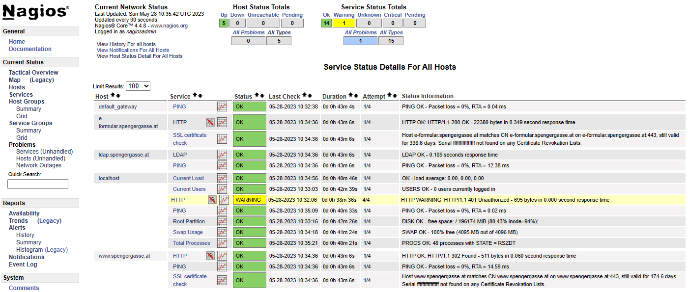

# Nagios Containerimage

Dies ist ein Fork des Dockerfiles von https://github.com/JasonRivers/Docker-Nagios mit einer fertigen Beispielkonfiguration mit Rechnern aus dem Schulnetzwerk.

Tipp: Du kannst das Containerimage auch auf einem Raspberry Pi erstellen, wenn du selbst dein Netzwerk zu Hause überwachen willst.



## Erstellen des Dockerimages

Klone das Repo in einen Ordner auf deiner Festplatte:

```
git clone https://github.com/schletz/docker-nagios
```

Gehe danach in das Verzeichnis *docker-nagios*.
In diesem Verzeichnis muss sich die Datei *Dockerfile* befinden.
Gib danach den folgenden Befehl ein, um das Image *nagios-6aaif* zu erzeugen.
Hinweis: Für diesen Befehl muss Docker laufen, d. h. Docker Desktop muss davor gestartet werden.

```
cd docker-nagios
docker build -t nagios-6aaif .
```

Um einen Container zu erstellen, der das Image *nagios-6aaif* verwendet, führe den folgenden Befehl aus:

**Windows Eingabeaufforderung**
```
docker run -d --name nagios-6aaif -v C:\Temp\nagios\etc:/opt/nagios/etc/ -p 0.0.0.0:8080:80 nagios-6aaif
```

**macOS**

Beim Starten des Containers werden die Konfigurationsdateien in das etc Verzeichnis geschrieben.
Da auch ein Shellskript dabei ist, musst du mit *chmod* die Ausführungsrechte setzen.
Warte nach *docker run*, bis der Container gestartet ist.
Setze erst danach den *chmod* Befehl ab.
Danach genügt es, den Container normal mit Docker Desktop oder dem *docker* Command zu starten.
```
docker run -d --name nagios-6aaif -v $HOME/nagios/etc:/opt/nagios/etc/ -p 0.0.0.0:8080:80 nagios-6aaif
# Wait here until the container has been started.
chmod -R 777 $HOME/nagios/etc
```

## Login

Rufe nun im Browser die Adresse http://localhost:8080 auf.
Du kannst dich mit folgenden Daten anmelden:

**Username:** nagiosadmin  
**Passwort:** nagios

## Konfigurationsdateien

Die Konfigurationsdateien sind nach dem Start des Containers in *C:\\Temp\\nagios\\etc* (Windows) bzw. im Homeverzeichnis unter *nagios/etc* (macOS) verfügbar.
Es gibt einen Ordner *spengergasse*, indem das Schulnetzwerk abgebildet ist.
Achte auf korrekte Zeilenumbrüche (LF, nicht CRLF).
Wenn du die Konfiguration änderst, musst du mit folgendem Befehl die Konfiguration neu lesen.
Er wird im **Hostsystem** (Windows oder macOS) ausgeführt.

```
docker exec nagios-6aaif nagios -v /opt/nagios/etc/nagios.cfg
docker restart nagios-6aaif
```
